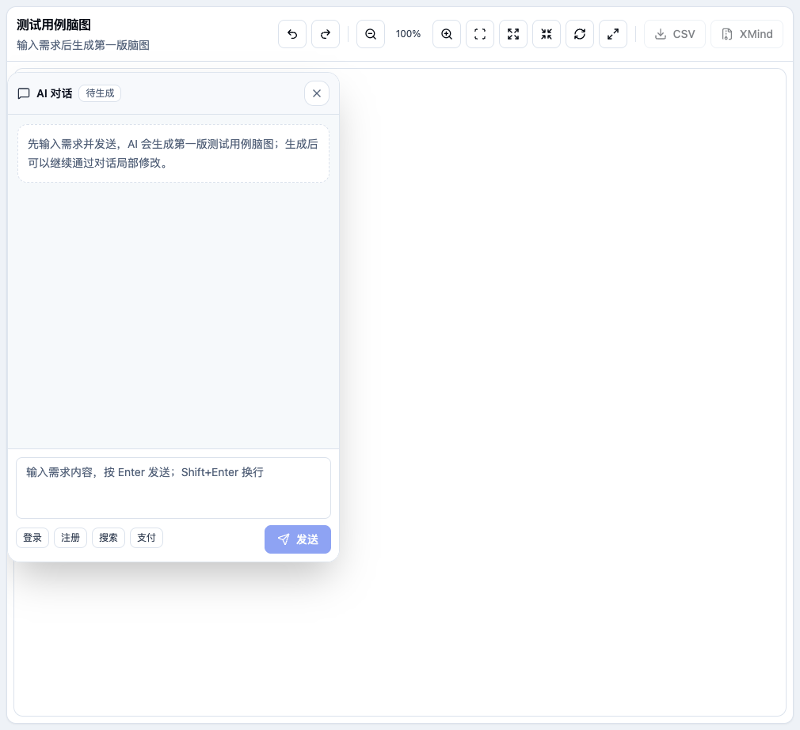
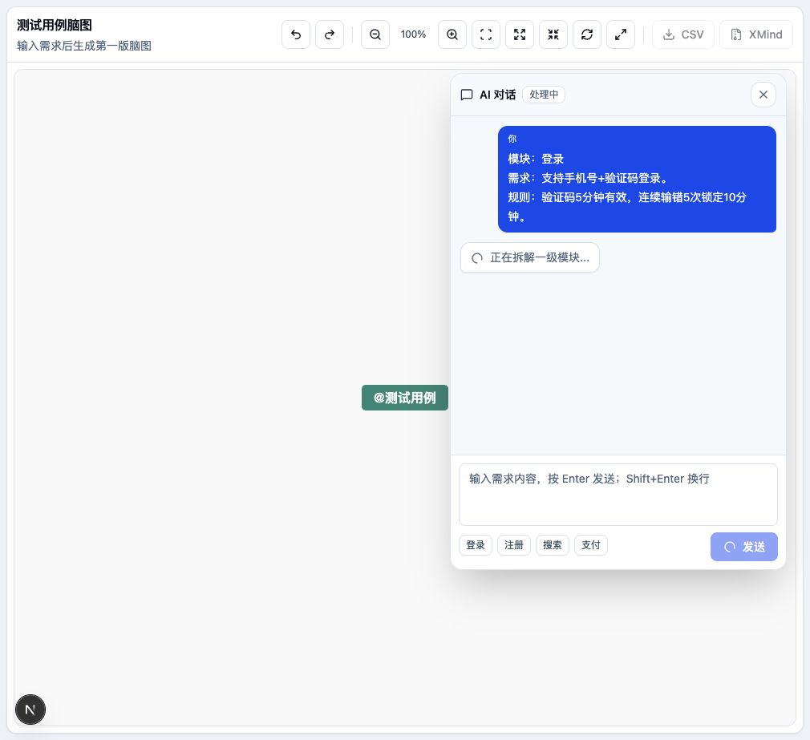
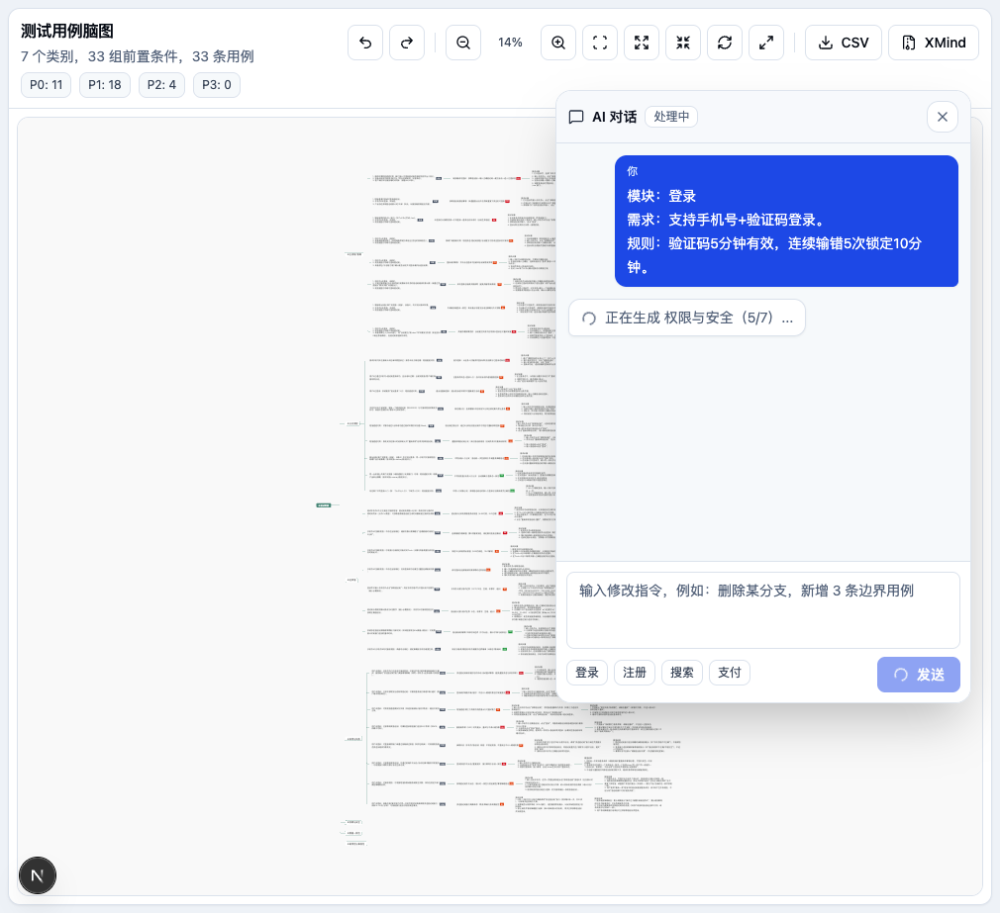
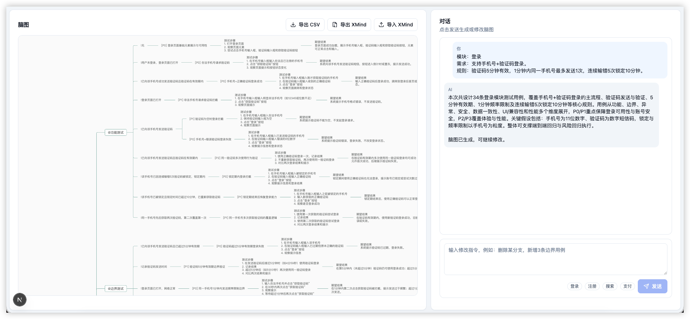
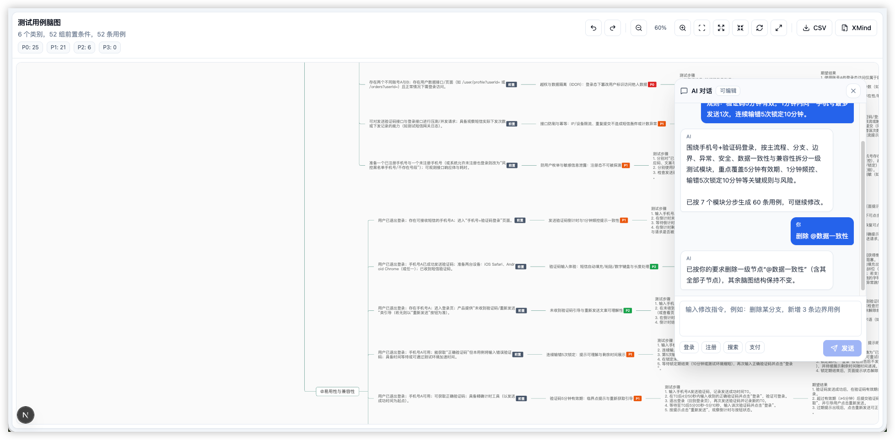
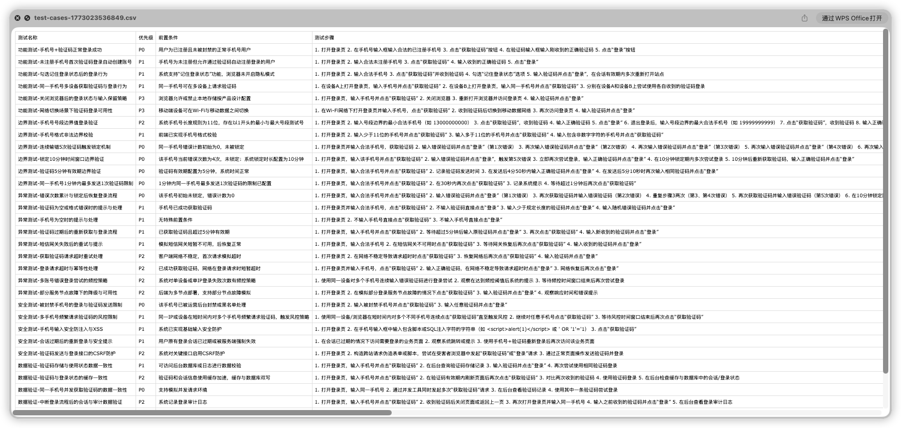
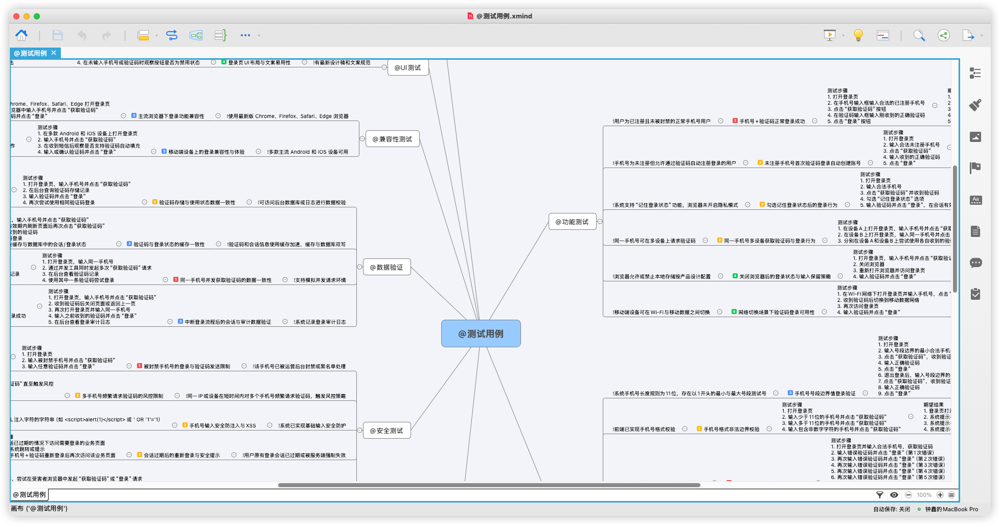

# next-ai-test-cases

Test case generation assistant, built with Next.js, LangChain, shadcn/ui, and simple-mind-map.

The app uses a mind map editor as the main canvas, with AI conversation displayed as draggable bubble overlays. After the first requirement is sent, the system first generates a top-level module skeleton, then gradually supplements test cases module by module, avoiding long blank waiting periods; subsequent continuous conversations can locally add, delete, or modify the mind map.

## Core Features

- AI step-by-step test case generation: first plan top-level modules, then generate cases module by module
- Continuous conversation to modify the mind map: supports adding, deleting, renaming, adjusting priority, and supplementing scenarios
- Large canvas mind map editing: zoom, fit canvas, expand/collapse, undo/redo, fullscreen
- Bubble-style AI conversation panel: draggable, collapsible, does not occupy left-right split space
- Mind map structure: Category -> Precondition -> Test Case -> Test Steps -> Expected Result
- Priority displayed as `P0`/`P1`/`P2`/`P3` tags, not written into the test case title
- Preconditions displayed with a `前置` tag, `!` not shown in the title
- Clicking a priority tag directly switches between P0-P3
- Export CSV (includes test name, priority, precondition, steps, expected result)
- Export XMind (priority written as XMind marker)
- Optional MCP: only attempts to read `mcp.json` when the requirement contains links or external document keywords

## Interface Screenshots

### Empty State



### Step-by-step Generation in Progress



### Tag Mind Map



### Generation Complete



### Conversation Modification



### Export CSV



### Export XMind



## Tech Stack

- Next.js 16 (App Router)
- React 19
- LangChain.js 1.x
- @langchain/openai
- @langchain/mcp-adapters
- shadcn/ui
- lucide-react
- simple-mind-map `0.14.0-fix.2`
- JSZip

## Quick Start

```bash
pnpm install
cp .env.example .env.local
pnpm dev
```

Default access:

```text
http://localhost:3000
```

If you need to pin it to 3001:

```bash
pnpm exec next dev -p 3001
```

## Environment Variables

`.env.local`:

```env
OPENAI_API_KEY=
OPENAI_MODEL=gpt-5.1
OPENAI_BASE_URL=
```

Notes:

- `OPENAI_API_KEY` is required
- `OPENAI_MODEL` is optional; if not set, the server defaults to `gpt-4.1-mini`
- `OPENAI_BASE_URL` is optional, for OpenAI-compatible gateways
- When using `gpt-5*` models, the code automatically avoids passing a non-default temperature

## MCP Configuration

`mcp.json` is an optional file; its absence does not affect normal requirement generation.

When the requirement text contains keywords such as URL, Confluence, Kaptain, Jira, Wiki, etc., the server attempts to read `mcp.json` from the project root and load MCP tools; if the file does not exist or the configuration is invalid, it automatically falls back to a regular model call.

To copy from the template:

```bash
cp mcp.json.example mcp.json
```

Currently supported:

- `stdio`
- `http`
- `sse`

Loading logic is located in:

- `src/lib/agent/testCaseAgent.ts`

## Generation Flow

When a requirement is first sent, the frontend no longer waits for a single large result, but makes step-by-step requests:

1. `POST /api/test-case-agent/plan`
   - Generates top-level module planning
   - Returns a module skeleton mind map
   - The page immediately renders the first-level nodes

2. `POST /api/test-case-agent/module`
   - Generates test cases for each module one by one
   - After each module is generated, it is merged into the current mind map
   - The chat bubble shows the current module generation progress

The old one-shot interface is retained:

- `POST /api/test-case-agent`

## Mind Map Data Conventions

Root node:

```text
@测试用例
```

Node hierarchy:

```text
@Category
Precondition node (tag: ["前置"])
Test case node (data.priority + tag: ["P1"])
Test steps
Expected result
```

Conventions:

- Category node titles retain `@`, used to identify first-level test categories
- Precondition node titles do not display `!`, identified by `tag: ["前置"]`
- Test case titles do not display `[P1]`, priority is stored in `data.priority` and `data.tag`
- Old data containing `!Precondition`, `[P1] Case Name` will be cleaned up during normalization on both the frontend and server

## Export Description

### CSV Column Structure

- `Test Name`
- `Priority`
- `Precondition`
- `Test Steps`
- `Expected Result`

### XMind Structure

- Root node: `@测试用例`
- Second level: `@Category`
- Third level: Precondition
- Fourth level: Test case node
- Fifth level: `Test Steps`
- Sixth level: `Expected Result`

Priority is written as an XMind marker:

- `P0` -> `priority-1`
- `P1` -> `priority-2`
- `P2` -> `priority-3`
- `P3` -> `priority-4`

## Main Directories

- `src/app/page.tsx`: Main page, includes the mind map canvas, bubble chat, and step-by-step generation flow
- `src/components/mindmap/mindmap-view.tsx`: simple-mind-map wrapper, tag display, priority switching
- `src/lib/agent/testCaseAgent.ts`: Agent, prompts, structured output, MCP loading, mind map construction
- `src/lib/agent/types.ts`: Test cases, module planning, mind map types
- `src/app/api/test-case-agent/plan/route.ts`: First-level module planning endpoint
- `src/app/api/test-case-agent/module/route.ts`: Single module test case generation endpoint
- `src/app/api/test-case-agent/route.ts`: One-shot generation endpoint (retained for compatibility)
- `src/app/api/test-case-agent/chat/route.ts`: Continuous conversation update endpoint
- `src/app/api/test-case-agent/export-xmind/route.ts`: XMind export endpoint
- `mcp.json.example`: MCP configuration template

## Common Commands

```bash
pnpm dev
pnpm lint
pnpm build
```
