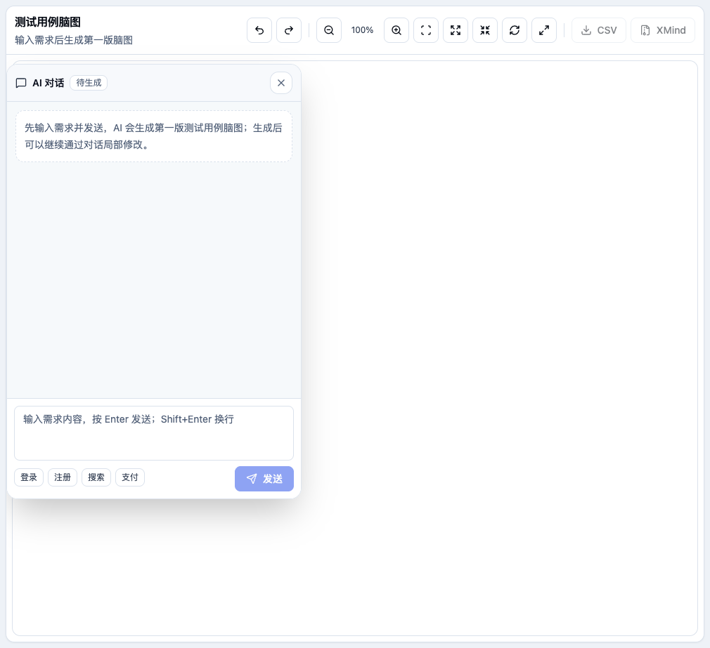
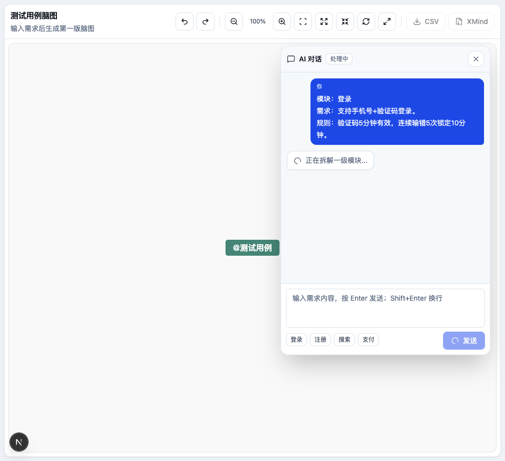
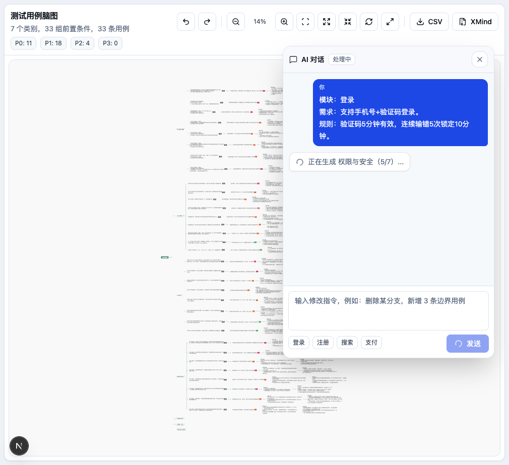
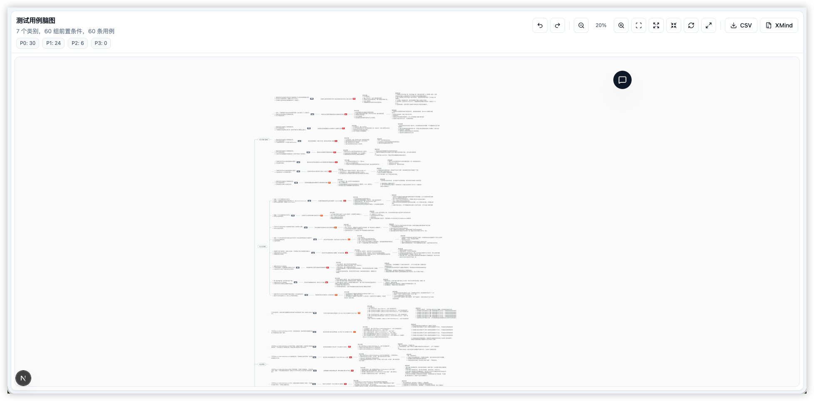
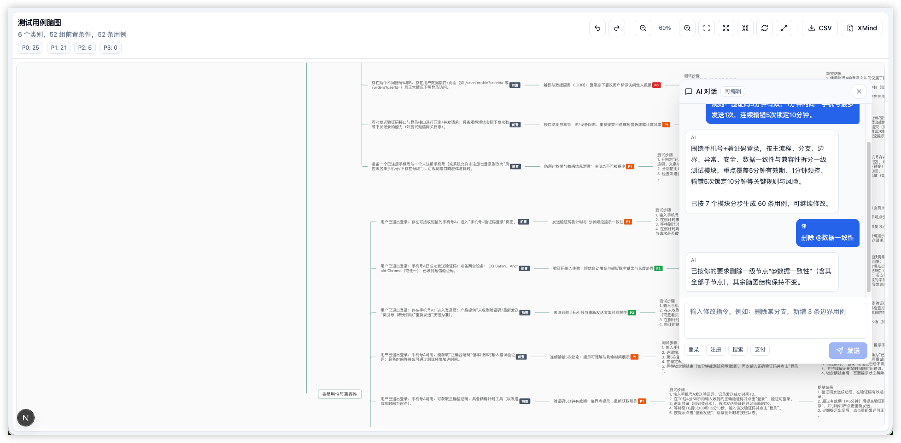
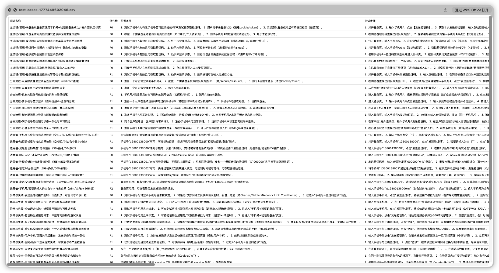
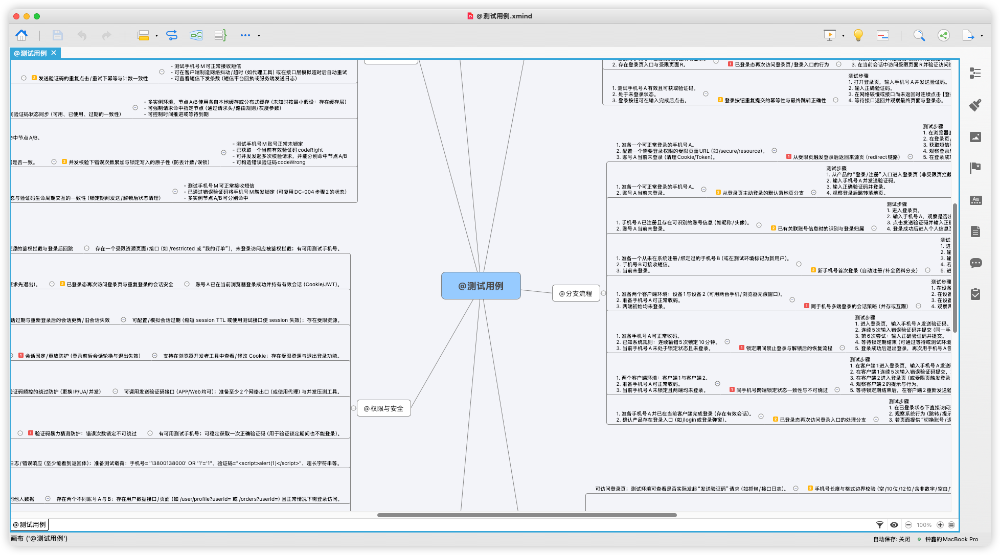

# next-ai-test-cases

测试用例生成助手，基于 Next.js、LangChain、shadcn/ui 和 simple-mind-map 构建。

应用以脑图编辑区为主画布，AI 对话以可拖拽气泡浮层展示。首次发送需求后，系统会先生成一级模块骨架，再按模块逐步补充测试用例，避免长时间空白等待；后续可以通过连续对话局部增删改脑图。

## 核心功能

- AI 分步生成测试用例：先规划一级模块，再逐模块生成用例
- 连续对话修改脑图：支持新增、删除、改名、调整优先级、补充场景
- 大画布脑图编辑：缩放、适应画布、展开/折叠、撤销/重做、全屏
- 气泡式 AI 对话面板：可拖拽、可收起，不占用左右分屏空间
- 脑图结构：类别 -> 前置条件 -> 用例 -> 测试步骤 -> 期望结果
- 优先级以 `P0`/`P1`/`P2`/`P3` 标签展示，不写入用例标题
- 前置条件以 `前置` 标签展示，不在标题里展示 `!`
- 点击优先级标签可直接切换 P0-P3
- 导出 CSV（含测试名称、优先级、前置条件、步骤、期望结果）
- 导出 XMind（优先级写入 XMind marker）
- 可选 MCP：仅当需求包含链接或外部文档关键词时尝试读取 `mcp.json`

## 界面截图

### 空白态



### 分步生成中



### 标签脑图



### 生成完成



### 对话修改



### 导出 CSV



### 导出 XMind



## 技术栈

- Next.js 16（App Router）
- React 19
- LangChain.js 1.x
- @langchain/openai
- @langchain/mcp-adapters
- shadcn/ui
- lucide-react
- simple-mind-map `0.14.0-fix.2`
- JSZip

## 快速开始

```bash
pnpm install
cp .env.example .env.local
pnpm dev
```

默认访问：

```text
http://localhost:3000
```

如果需要固定到 3001：

```bash
pnpm exec next dev -p 3001
```

## 环境变量

`.env.local`：

```env
OPENAI_API_KEY=
OPENAI_MODEL=gpt-5.1
OPENAI_BASE_URL=
```

说明：

- `OPENAI_API_KEY` 必填
- `OPENAI_MODEL` 选填；不填时服务端默认使用 `gpt-4.1-mini`
- `OPENAI_BASE_URL` 选填，适用于 OpenAI 兼容网关
- 使用 `gpt-5*` 模型时，代码会自动避免传入非默认 temperature

## MCP 配置

`mcp.json` 是可选文件，没有也不影响普通需求生成。

当需求文本包含 URL、Confluence、Kaptain、Jira、Wiki 等外部文档关键词时，服务端会尝试读取项目根目录的 `mcp.json` 并加载 MCP 工具；如果文件不存在或配置无效，会自动回退到普通模型调用。

可从模板复制：

```bash
cp mcp.json.example mcp.json
```

当前支持：

- `stdio`
- `http`
- `sse`

加载逻辑位于：

- `src/lib/agent/testCaseAgent.ts`

## 生成流程

首次发送需求时，前端不再等待一次性大结果，而是分步请求：

1. `POST /api/test-case-agent/plan`
   - 生成一级模块规划
   - 返回模块骨架脑图
   - 页面立即渲染一级节点

2. `POST /api/test-case-agent/module`
   - 按模块逐个生成测试用例
   - 每生成完一个模块就合并进当前脑图
   - 聊天气泡显示当前模块生成进度

旧的一次性接口仍保留：

- `POST /api/test-case-agent`

## 脑图数据约定

根节点：

```text
@测试用例
```

节点层级：

```text
@类别
前置条件节点（tag: ["前置"]）
测试用例节点（data.priority + tag: ["P1"]）
测试步骤
期望结果
```

约定：

- 类别节点标题保留 `@`，用于识别一级测试类别
- 前置条件节点标题不展示 `!`，使用 `tag: ["前置"]` 标识
- 用例标题不展示 `[P1]`，优先级写在 `data.priority` 和 `data.tag`
- 旧数据中的 `!前置条件`、`[P1] 用例名` 会在前端和服务端归一化时清洗

## 导出说明

### CSV 列结构

- `测试名称`
- `优先级`
- `前置条件`
- `测试步骤`
- `期望结果`

### XMind 结构

- 根节点：`@测试用例`
- 二级：`@类别`
- 三级：前置条件
- 四级：测试用例节点
- 五级：`测试步骤`
- 六级：`期望结果`

优先级会写入 XMind marker：

- `P0` -> `priority-1`
- `P1` -> `priority-2`
- `P2` -> `priority-3`
- `P3` -> `priority-4`

## 主要目录

- `src/app/page.tsx`：主页面，包含脑图画布、气泡聊天和分步生成流程
- `src/components/mindmap/mindmap-view.tsx`：simple-mind-map 封装、标签展示、优先级切换
- `src/lib/agent/testCaseAgent.ts`：Agent、提示词、结构化输出、MCP 加载、脑图构建
- `src/lib/agent/types.ts`：测试用例、模块规划、脑图类型
- `src/app/api/test-case-agent/plan/route.ts`：一级模块规划接口
- `src/app/api/test-case-agent/module/route.ts`：单模块用例生成接口
- `src/app/api/test-case-agent/route.ts`：一次性生成接口（兼容保留）
- `src/app/api/test-case-agent/chat/route.ts`：连续对话更新接口
- `src/app/api/test-case-agent/export-xmind/route.ts`：导出 XMind
- `mcp.json.example`：MCP 配置模板

## 常用命令

```bash
pnpm dev
pnpm lint
pnpm build
```
