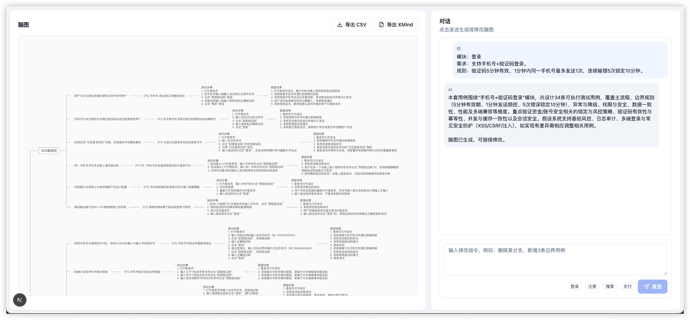

# next-ai-test-cases

使用 `LangChain.js + shadcn/ui + simple-mind-map` 构建的测试用例生成助手。

## 功能

- 左右布局：左侧脑图，右侧对话
- 右侧上下布局：上方对话记录，下方输入区
- 仅通过“发送”按钮触发流程：
  - 首次发送：根据输入需求生成脑图
  - 后续发送：通过对话增删改脑图
- 输入区支持模板 tag（登录/注册/搜索/支付）快速插入需求
- 支持导出 `.xmind`（可在 XMind 中继续编辑）
- 支持导出 CSV（测试用例标准列）

## 界面预览

### 生成脑图


### 部分用例展示



### 对话修改脑图


### 导出 CSV


### 导出 XMind


## 技术栈

- Next.js 15 (App Router)
- LangChain.js + OpenAI
- shadcn/ui 组件风格
- simple-mind-map

## 本地运行

```bash
pnpm install
cp .env.example .env.local
pnpm dev
```

打开 `http://localhost:3000`。

## 环境变量

- `OPENAI_API_KEY`: OpenAI API Key
- `OPENAI_MODEL`: 可选，默认 `gpt-5.1`
- `OPENAI_BASE_URL`: 可选，自定义 OpenAI 兼容网关地址

## MCP 配置

项目提供了 MCP 配置模板文件：`mcp.json.example`。

使用方式：

1. 复制模板：
   `cp mcp.json.example mcp.json`
2. 在 `mcp.json` 中填写你自己的 MCP Server 配置
3. Agent 会在“生成脑图”和“对话修改”时自动读取 `mcp.json` 并调用 MCP

说明：

- 当前自动调用支持 `http` 与 `stdio` 两种 MCP
- 通过 `@langchain/mcp-adapters` 加载 MCP tools，并使用 LangChain Agent 按需调用
- MCP 返回内容会作为外部上下文注入提示词，参与测试用例与脑图生成

## CSV 导出格式

CSV 使用 UTF-8 BOM，列固定为：

- `测试名称`
- `优先级`
- `前置条件`
- `测试步骤`
- `期望结果`

其中 `测试名称 = category + "-" + topic`。

## 目录结构

- `mcp.json.example`: MCP 配置模板（复制为 `mcp.json` 后按需填写）
- `src/app/page.tsx`: 主界面（左脑图 + 右对话）
- `src/app/api/test-case-agent/route.ts`: 首次生成 API
- `src/app/api/test-case-agent/chat/route.ts`: 连续对话更新脑图 API
- `src/app/api/test-case-agent/export-xmind/route.ts`: 导出 XMind API
- `src/lib/agent/testCaseAgent.ts`: LangChain 生成逻辑（内含 MCP 读取与 createAgent 工具调用）
- `src/components/mindmap/mindmap-view.tsx`: simple-mind-map 渲染
